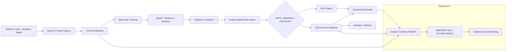

# GuideKaro Full Project Architecture

The PNG in this folder is the presentation-ready architecture diagram.

## Logical architecture

## Key change from the first prototype

The first prototype mainly used object counts. The enhanced version uses persistent track IDs and features from object motion:

- Track ID
- Detection confidence
- Speed
- Distance to crosswalk
- Pedestrian–vehicle separation
- Movement direction
- Predicted trajectory
- Crosswalk occupancy
- Approximate time-to-collision
- Weather / visibility flags

This makes the risk decision traceable and feature based.
